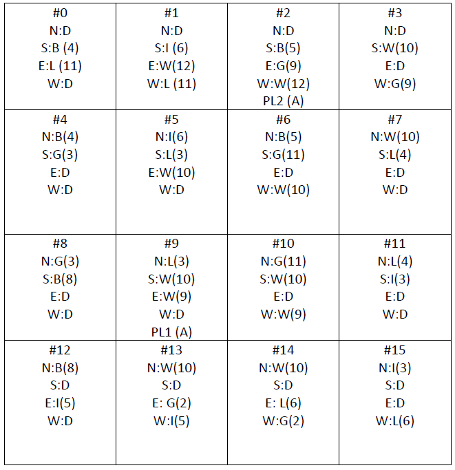

# 2º Projeto de Introdução à Computação 2018/2019

## Descrição do problema
Pretende-se desenvolver uma versão simplificada do jogo Settlers of Catan.
O jogo é turn based e decorre sobre um mapa 2D como o da Figura 1. Cada posição do mapa tem terrenos adjacentes a Norte (N), Sul (S), Este (E) e Oeste (O) que produzem recursos naturais e que estão associados a números. Os recursos naturais existentes são: wool (W), brick (B), lumber (L), grain (G), iron (I) ou desert (D).



No início do jogo, cada jogador escolhe um local para instalar a sua primeira aldeia (A). Em cada jogada, o jogador lança dois dados. Todos os jogadores que tenham aldeias em posições com terrenos adjacentes cujo número for igual à soma dos dois dados, ganham uma carta com os recursos naturais produzidos pelos terrenos adjacentes. Por exemplo, considerando o mapa da Figura 1, se a soma dos dois dados lançados for 9, o PL1 recebe uma carta de Wool e o PL2 recebe uma carta de Grain.
Para expandir o seu território cada jogador terá de colocar aldeias nos locais ligados a uma aldeia sua. Por exemplo no mapa da Figura 1, o PL1 só poderá construir uma aldeia nos locais com coordenadas #5, #8, #10 e #13. O PL2 só poderá construir aldeias nos locais com coordenadas #1, #3, #6.

Nota que o lançamento de dois dados implica que alguns números têm maior probabilidade de sair do que outros…

O PL1 escolhe primeiro a posição da sua aldeia e em seguida o PL2 escolhe a posição da sua aldeia. Cada posição só pode pertencer a um jogador e se já estiver ocupada, não pode ser escolhida.

Quando chega a sua vez, o jogador tem obrigatoriamente de lançar os dados antes de fazer qualquer outra acção. Depois dos dados lançados enquanto tiver recursos para isso, o jogador pode:
- Comprar uma aldeia e coloca-la numa posição adjacente
- Transformar uma aldeia (A) sua numa cidade (C). Quando o jogador tem uma cidade, os terrenos adjacentes passam a produzir duas unidades de recurso natural em vez de uma.
- Efectuar uma troca com o banco ao rácio 4 para 1. Para isso o jogador pode trocar 4 unidades iguais de um recurso natural, por uma carta de um recurso natural que necessite.
- Efectuar uma troca com o banco: 10 cartas igual em troca de um ponto.
- Passar a vez ao outro jogador
O objectivo do jogo é chegar primeiro aos 6 pontos: cada aldeia vale 1 ponto e cada cidade vale 2 pontos.

Preços:
- Aldeia: B + L + G + W
- Cidade: G + G + O + O + O

## Invocação do programa
O programa deve aceitar como único parâmetro um ficheiro de configuração em formato [INI]<sup>[4](#fn4)</sup>, de acordo com o seguinte exemplo:
```INI
; Dimensao da grelha de jogo
xdim=20
ydim=20
; Definicao da grelha
N=D
S=B4
E=L11
W=D
N=D
S=I6
E=W12
W=L11
…
```

Os campos indicados no exemplo anterior são obrigatórios e o programa deve saber interpretá-los corretamente. O programa deve ainda ignorar campos que não conheça. Os alunos podem acrescentar campos que considerem úteis para o desenvolvimento do projeto, mas estes devem ser opcionais. Por outras palavras, o programa deve assumir valores por omissão para campos opcionais extra. Um ficheiro INI usado para um projeto deve funcionar sem erros noutro projeto.

Se não for indicado o ficheiro de configuração, o programa deve terminar com uma mensagem de erro para stderr, indicando o modo de uso.

## Requisitos mínimos:
- É proibido utilizar variáveis globais.
- O mapa deverá ser guardado numa matriz (ou vector) alocado dinamicamente (i.e. utilizando calloc(…)).
- É proibido utilizar a instrução goto!
- É obrigatório a criação de um Makefile
- É obrigado utilizar o git. Para isso cada grupo deverá fazer fork deste repositório e depois clone para a vossa máquina. Deverão criar uma directoria com o nome “grupoN” em que N é o número do vosso grupo e adicionar essa directoria ao git. Deverão colocar o código dentro dessa directoria. Não deverão colocar os ficheiros executáveis no git, apenas os ficheiros .c, .h, Makefile, .map, .gitignore e outros que ficheiros que achem essenciais.


## Entrega

O projeto deve ser entregue via Moodle até às 23h de 22 de janeiro de 2019.
Deve ser submetido um ficheiro `zip` com os seguintes conteúdos:

* Ficheiros `.c` e `.h`, ficheiro `Makefile`, ficheiro `Doxyfile` e ficheiro
  `.gitignore`.
* Pasta escondida `.git` contendo o repositório Git local do projeto.
* Ficheiro `README.md` contendo o relatório do projeto em formato [Markdown]
  organizado da seguinte forma:
  * Título do projeto.
  * Nome dos autores (primeiro e último) e respetivos números de aluno.
  * Descrição da solução:
    * Arquitetura da solução, com breve explicação de como o programa foi
      estruturado.
      * Um fluxograma simples.
    * Estruturas de dados: grelha de simulação, outras estruturas
      auxiliares relevantes.
    * Algoritmos relevantes.
  * Manual de utilizador:
    * Como compilar: qual o comando ou comandos gerar uma _build_ do jogo.
    * Como jogar.
  * Conclusões e matéria aprendida.
  * Referências:
    * Incluindo trocas de ideias com colegas, código aberto reutilizado e
      bibliotecas de terceiros utilizadas. Devem ser o mais detalhados possível.
